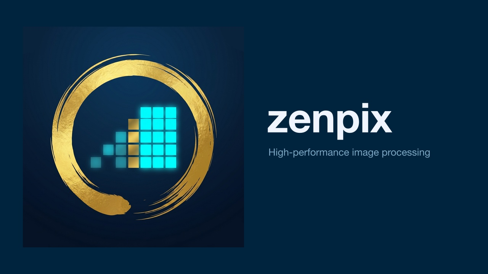

# zenpix



**npm:** [zenpix](https://www.npmjs.com/package/zenpix)（Node / Bun / Deno・ネイティブ） · [zenpix-wasm](https://www.npmjs.com/package/zenpix-wasm)（ブラウザ向け AVIF エンコード）

Zig 製の高速画像処理ライブラリです。  
JPEG / PNG / 静止画 WebP をデコードし、Lanczos-3 リサイズを経て WebP / AVIF にエンコードします。  
**HEIC / HEIF は非対応。** 必要ならクライアントで JPEG/PNG に変換してから渡してください（HEVC 特許・対応環境の都合でコアのスコープ外）。

- **AVIF エンコード**: 代表ベンチでは speed=10 が Sharp より **wall-clock で短く**、Sharp がマルチスレッドで積み上げる **CPU user 時間より遥かに軽い**（条件は下表・[比較の読み方](#比較の読み方)）
- **WebP エンコード**: lossy / lossless 対応
- **Lanczos-3 リサイズ**: SIMD 最適化（aarch64 NEON / x86_64 SSE2）
- **Node.js / Bun / Deno 対応**: Node.js・Bun は koffi、Deno は `Deno.dlopen` 経由でネイティブバイナリを呼び出し

## インストール

**Node.js / Bun**

```bash
npm install zenpix
```

> **ESM 専用パッケージです。** `package.json` に `"type": "module"` が必要です。  
> CommonJS (`require`) は現在非対応です。

**Deno**

```bash
deno add npm:zenpix
```

または直接 `npm:` specifier を使用：

```typescript
import { decode, resize, encodeWebP, encodeAvif, encodePng, crop } from "npm:zenpix/deno";
```

> Deno での実行時は `--allow-ffi` フラグが必要です。

### システム依存ライブラリ

**v0.1.0 以降は追加インストール不要です。** `libavif` と `libaom` はバイナリに静的リンク済みです。

> ソースからビルドする場合（開発者向け）は `docs/operations.md`、**npm 公開手順**は `docs/release.md` を参照してください。

## 使い方

```typescript
import { decode, resize, encodeWebP, encodeAvif, encodePng, crop } from "zenpix";
import { readFileSync, writeFileSync } from "fs";

// JPEG / PNG / WebP（静止画）をデコード
const input = readFileSync("input.jpg");
const image = decode(input);

// Lanczos-3 リサイズ（幅指定、高さはアスペクト比維持）
const resized = resize(image, { width: 1920 });

// WebP エンコード
const webp = encodeWebP(resized, { quality: 92 });
writeFileSync("output.webp", webp);

// AVIF エンコード（libavif / libaom は静的リンク済み、追加インストール不要）
const avif = encodeAvif(resized, { quality: 60, speed: 10 });
if (avif) writeFileSync("output.avif", avif);

// PNG エンコード（ICC プロファイルがあれば iCCP チャンクとして埋め込み）
const png = encodePng(resized, { compression: 6 });
writeFileSync("output.png", png);

// crop（サムネイル用矩形切り出し）
const thumb = crop(resized, { left: 0, top: 0, width: 400, height: 300 });
const thumbWebP = encodeWebP(thumb, { quality: 85 });
writeFileSync("thumb.webp", thumbWebP);
```

## API

### `decode(input: Buffer | Uint8Array): ImageBuffer`

JPEG・PNG・静止画 WebP をデコードして生ピクセルデータを返します。内部では埋め込み ICC も取り出せる `pict_decode_v3` を使います。HEIC / HEIF・アニメーション WebP・その他の形式は **未対応**（失敗時は `zenpix: decode failed`）。

**JPEG の EXIF Orientation は自動適用されます。** Orientation 2〜8（水平反転・180° 回転・垂直反転・転置・90° CW・逆転置・90° CCW）はすべて処理され、返される `data` / `width` / `height` が正位置に合わせて変換されます（orientation=1 は追加処理なし）。

```typescript
interface ImageBuffer {
  data: Buffer;     // 生ピクセル（row-major, top-left origin）
  width: number;
  height: number;
  channels: number; // 3 = RGB, 4 = RGBA
  icc?: Buffer;     // 埋め込み ICC（JPEG / PNG / WebP ICCP 等。無い画像では省略）
}
```

### `resize(image: ImageBuffer, options: ResizeOptions): ImageBuffer`

Lanczos-3 フィルタでリサイズします。`width` / `height` の片方を省略するとアスペクト比を維持します。入力に `icc` がある場合は出力にも引き継ぎ、その後の `encodeWebP` で WebP に ICC を埋め込めます。

```typescript
interface ResizeOptions {
  width?: number;    // 出力幅（px）
  height?: number;   // 出力高さ（px）
  threads?: number;  // 並列スレッド数（デフォルト: 1）
}
```

### `encodeWebP(image: ImageBuffer, options?: WebPOptions): Buffer`

WebP にエンコードします。`image.icc` が設定されていれば libwebp の ICCP チャンクとして埋め込みます（FFI では `pict_encode_webp_v2`）。

```typescript
interface WebPOptions {
  quality?: number;   // 0–100（デフォルト: 92）
  lossless?: boolean; // ロスレス（デフォルト: false）
}
```

### `encodeAvif(image: ImageBuffer, options?: AvifOptions): Buffer | Uint8Array | null`

AVIF にエンコードします。以下の場合は `null` を返します：

- AVIF 無効でビルドされたバイナリを使用している
- `quality` が 0–100 の範囲外、または `speed` が 0–10 の範囲外

> Node.js / Bun では `Buffer`、Deno では `Uint8Array` を返します。

```typescript
interface AvifOptions {
  quality?: number; // 0–100（デフォルト: 60）
  speed?: number;   // 0–10（デフォルト: 6）。10 が最速
}
```

### `encodePng(image: ImageBuffer, options?: PngOptions): Buffer | Uint8Array`

PNG にエンコードします。`image.icc` が設定されていれば iCCP チャンクとして埋め込みます。`compression` が 0–9 の範囲外の場合は `Error` を投げます。

```typescript
interface PngOptions {
  compression?: number; // zlib 圧縮レベル 0–9（デフォルト: 6）
}
```

### `crop(image: ImageBuffer, options: CropOptions): ImageBuffer`

ピクセルデータから矩形領域を切り出します。ICC プロファイルは引き継ぎます。範囲外・ゼロ次元・不正値の場合は `Error` を投げます。

```typescript
interface CropOptions {
  left: number;   // 切り出し左端（px, 0 origin）
  top: number;    // 切り出し上端（px, 0 origin）
  width: number;  // 切り出し幅（px）
  height: number; // 切り出し高さ（px）
}
```

## ブラウザ / Cloudflare Pages 対応（WASM）

`zig build wasm` が出す WASI モジュールは **ネイティブ FFI とは別物**です。現状は C 連携デコード・ICC 抽出・WebP エンコードのフルパイプラインを載せておらず、ブラウザ向けの **`zenpix-wasm` は AVIF エンコード用途**に絞っています（詳細は `build.zig` の wasm ターゲット周辺コメントと `wasm/README.md`）。

小〜中サイズの画像（〜1024×1024）はブラウザ上で直接 AVIF エンコードできます。  
`zenpix-wasm` パッケージ（libavif + libaom を WebAssembly にコンパイル済み）を使います。

```bash
npm install zenpix-wasm
```

```typescript
import createAvif from 'zenpix-wasm';          // Emscripten factory

const Module = await createAvif();
const ptr = Module._malloc(pixels.length);
Module.HEAPU8.set(pixels, ptr);
const outPtr = Module._avif_encode(ptr, width, height, 4, 60, 10); // quality=60 speed=10
Module._free(ptr);
if (outPtr) {
  const size = Module._avif_get_out_size();
  const avif = Module.HEAPU8.slice(outPtr, outPtr + size);
  Module._avif_free_output(outPtr);
  // avif は Uint8Array (ftyp brand: "avif" ✅)
}
```

TypeScript ラッパー（`js/index.ts`）を使うとより簡潔に記述できます。詳細は [`wasm/README.md`](./wasm/README.md) を参照してください。

### WASM パフォーマンス実測値

環境: Chrome (macOS arm64), RGBA, quality=60, speed=10 最速設定、warm-up×1 除外・3回中央値

| サイズ | Baseline (ms) | SIMD (ms) | Speedup |
|--------|:-------------:|:---------:|:-------:|
| 64×64      |  0.5 |  0.5 | 1.00× |
| 256×256    |  5.1 |  4.2 | **1.21×** |
| 512×512    | 16.5 | 14.6 | **1.13×** |
| 1024×1024  | 60.5 | 53.1 | **1.14×** |

> ※ speed=10（最速）の値。大画像・低 speed 設定では数秒〜数十秒になる場合あります。  
> 1024×1024 を超える画像は Web Worker 上での実行を推奨します。

---

## ベンチマーク

### Node / `bench/bench.ts`（FHD・WQHD・4K 相当）

`npm run build` のうえ `npx tsx bench/bench.ts`（`sharp` は `devDependencies` に含む）。**同一パイプライン**: PNG **デコード** → **リサイズ**（出力ピクセルは表のとおり）→ **AVIF エンコード（quality=60, speed=6）**。入力 PNG は `test/fixtures/bench_input.png` を、**計測ループの外で** Sharp（`fit=cover`）により各代表解像度へ一度だけ拡大したバイト列。各シナリオで zenpix / Sharp を **warm-up 2・計測 10**し、**wall-clock の中央値（ms）**を比較。**ratio = Sharp 中央値 ÷ zenpix 中央値**（**1 超**なら zenpix の中央値が速い）。

成果物は `bench/results/benchmark.json` / `benchmark.md` に加え、**比較用 AVIF**（`samples/matrix-{fixture id}-{シナリオ id}-zenpix.avif` / `…-sharp.avif`）と **`report.html`**（`bench/results/` をカレントにしてブラウザで開くと相対パスで画像表示）。`BENCH_WRITE_SAMPLES=0` のときは JSON/Markdown のみ。

**入力画像**は `test/fixtures/` の PNG を使う。既定では `bench_input.png` に加え、`bench_chara_*.png`・`bench_landscape_*.png` など複数枚を **同一シナリオ（FHD / WQHD / 4K 相当）**で順に計測する。**一部だけ**回す場合は `BENCH_FIXTURES=bench_input,bench_landscape_light` のように **カンマ区切りの id** を指定。**GitHub Actions** のベンチジョブは時間短縮のため `BENCH_FIXTURES=bench_input` のみ。

| シナリオ | 入力 | 出力 | zenpix（ms） | Sharp（ms） | ratio |
|----------|------|------|-------------:|------------:|------:|
| FHD 相当 | 1920×1080 | 960×540 | 139.90 | 37.80 | **0.27×** |
| WQHD 相当 | 2560×1440 | 1280×720 | 242.27 | 44.47 | **0.18×** |
| 4K 相当 | 3840×2160 | 1920×1080 | 558.33 | 83.46 | **0.15×** |

#### VPS 実測（同一スクリプト・3 回実行のセルごとの中央値）

**条件**は上のマトリクスと同じ（decode → resize → AVIF、**quality=60 / speed=6**、**warm-up 2・計測 10**）。`BENCH_FIXTURES=bench_input,bench_chara_chika,bench_chara_kanata,bench_landscape_dark,bench_landscape_impasto,bench_landscape_light`。**機材（計測時）**: **Ubuntu**・**vCPU 2**・**RAM 2 GB**。**runner** は成果物 JSON の `linux-x64 (local)`。2026-04-15 に **3 回**計測し、各セルで **zenpix / Sharp の wall-clock 中央値（ms）をさらに 3 値の中央値**にまとめた。**ratio = Sharp 中央値 ÷ zenpix 中央値**（再計算）。

| フィクスチャ | FHD | WQHD | 4K |
|--------------|----:|-----:|---:|
| `bench_input` | 0.26 | 0.25 | 0.24 |
| `bench_chara_chika` | 1.35 | 1.26 | 1.19 |
| `bench_chara_kanata` | 1.19 | 1.06 | 1.07 |
| `bench_landscape_dark` | 1.14 | 1.19 | 0.96 |
| `bench_landscape_impasto` | 1.46 | 1.36 | 1.43 |
| `bench_landscape_light` | 1.02 | 0.91 | 0.79 |

**傾向（この VPS・この条件）**: 小さめタイル系（`bench_input`）では **Sharp が速い**。キャラ・厚塗り風景では **zenpix が有利な行が多い**。`bench_landscape_light` の WQHD / 4K は **Sharp がやや速い**。`bench_landscape_dark` の 4K は **ほぼ互角**。生データは手元の `bench-results-vps-run1` 〜 `run3` の `benchmark.json`（未コミット想定）。**他 runner と数値を直接比較しない**こと。

#### Mac 実測（同一スクリプト・3 回実行のセルごとの中央値）

**条件**は VPS 実測と同一（上記 `BENCH_FIXTURES`・quality/speed・反復）。**機材（計測時）**: **14 インチ MacBook Pro（Apple M4 Pro）**・メーカー公称 **CPU 14 コア / GPU 20 コア**・**RAM 24 GB**・SSD 1 TB。**runner** は JSON の `darwin-arm64 (local)`。2026-04-15 に **3 回**計測（各 `benchmark.json` の `date`: 13:02Z / 13:16Z / 13:22Z 前後）。集計方法は VPS と同じ。

| フィクスチャ | FHD | WQHD | 4K |
|--------------|----:|-----:|---:|
| `bench_input` | 0.26 | 0.18 | 0.15 |
| `bench_chara_chika` | 0.60 | 0.44 | 0.41 |
| `bench_chara_kanata` | 0.63 | 0.46 | 0.38 |
| `bench_landscape_dark` | 0.55 | 0.51 | 0.38 |
| `bench_landscape_impasto` | 0.57 | 0.44 | 0.37 |
| `bench_landscape_light` | 0.53 | 0.46 | 0.35 |

**傾向（この Mac・この条件）**: **すべてのセルで ratio は 1 未満**（Sharp の wall-clock が速い）。**外向きの主眼は VPS 表**とし、Mac 表は同一マシンでの**リグレッション検知**用。生データは `bench/results-mac-run1` 〜 `run3` の `benchmark.json`。

多 run の表を手元で再生成する場合: `npm run bench:aggregate`（`scripts/bench-aggregate-multi-run.mjs` が既定の 6 パスを読み、標準出力に Markdown 断片を出す）。

実測環境の例: **macOS arm64（Apple M）・ローカル**（2026-04-14 頃、`zenpix` 0.1.4 npm バイナリ、Sharp 0.34）。**GitHub Actions**（`ubuntu-24.04`）でも同スクリプトを実行し、成果物 `benchmark-linux-x64` に `bench/results/benchmark.md` と `benchmark.json` が添付される。

> 上表の条件では **Sharp の wall-clock が速い**。一方、次の「3840→1920」一点比較では **zenpix speed=10 が wall-clock で有利**のように、**解像度・パイプライン（デコード込みか・encoder speed）・マシン**で順位は入れ替わり得る。本マトリクスはトレンド解像度での **再現可能な比較**を先に置くためのもの。

### 3840×2160 PNG → 1920×1080 AVIF（手動計測・一点比較）

macOS aarch64 (Apple M) / ReleaseFast

| ツール | wall-clock（中央値）| CPU user | ファイルサイズ |
|--------|--------------------:|:--------:|---------------:|
| **zenpix speed=10**（シングルスレッド）| **0.710s** | 0.66s | 2.5 MB |
| zenpix speed=6（シングルスレッド）| 2.109s | 2.05s | 2.5 MB |
| Sharp 0.34 quality=60（〜8コア）| 1.141s | 9.27s | 1.5 MB |

### 比較の読み方

- **環境による棲み分け（目安）**: 同一パイプラインでも **runner ごとに ratio の傾向が変わる**。**少コア VPS**（上の **VPS 実測**の表）では一部フィクスチャで zenpix が wall-clock で有利になりやすい一方、**高スペック・マルチコア**（上の **Mac 実測**の 3 回中央値）では **Sharp が有利になりやすい**。libvips / Sharp は並列化しやすく、zenpix 側はジョブによってはシングルスレッドに近い処理が支配的になりやすい、などの要因が重なる。**入力・解像度・エンコーダ設定でも順位は変わる**ため、コア数だけの二択ルールではない。運用では **CPU 予算・同時リクエスト・レイテンシとスループットのどちらを優先するか**に合わせて選び、必要なら両系統でベンチする。
- **自動マトリクス**（`bench/bench.ts`）と**下の1ケース表**は別条件。前者は **decode+resize+AVIF（speed=6）** の 3 解像度、後者は **3840×2160 PNG → 1920×1080 AVIF**（zenpix は speed=10 / 6、Sharp は quality=60、macOS arm64、ReleaseFast）。解像度・品質・マシンが変われば順位は入れ替わり得る。
- **wall-clock** は体感に直結。上表では zenpix speed=10 が **0.710s**、Sharp が **1.141s**。
- **CPU user** は「そのプロセスが消費した CPU 時間の合計」。Sharp の **9.27s** は **複数コアに分散した合算**であり、「Sharp が遅い」のではなく「マルチスレッドで総仕事量を積み上げている」結果として大きく見える。**2コア VPS などリソースを奪い合う環境**では、この総量が他リクエストの遅延に効きやすい。
- **ファイルサイズ**は同条件でも一致していない（Sharp 1.5 MB / zenpix 2.5 MB）。圧縮率まで揃えた公平比較ではない。
- **結論**: 「あらゆる場面で Sharp より常に上」ではない。**低コア・CPU 予算を抑えたい用途**や、上記 VPS 実測のように **同一パイプラインで zenpix が wall-clock で有利になりうる条件**がある一方、**マルチコアでスループット最優先**なら Sharp を選ぶ棲み分けが現実的、という立ち位置。

### ベンチの拡張（方針）

- **今ある計測**は「同一パイプライン・同じ encoder の数値（quality / speed）」での **壁時計の比較**。**知覚画質やファイルサイズを揃えたうえでの速度**は別問題で、実装するならパラメータ探索や指標（SSIM 等）が要り、CI 本体には載せず **別スクリプト・手元・週次ジョブ**などに分ける想定。
- **主用途はイラスト**のため、写真 8K の網羅より、線・平坦色に効く**少数のイラスト系フィクスチャ**を足すのは後追いでよい。現状は `bench_input.png` を代表解像度へ拡大した 1 系統で、**トレンド解像度での再現性**を優先している。

品質・サイズ揃えのベンチは **`bench/bench-quality.ts`** でスパイク済み（`npm run build` のうえ **`npm run bench:quality`**）。Sharp をアンカーに **AVIF encode のみ**を計測し、zenpix の `quality` を走査して出力バイトを既定 ±10% 帯へ寄せる。成果物は `bench/results/benchmark-quality.json` / `benchmark-quality.md` に加え、`samples/quality-zenpix.avif` / `quality-sharp.avif` と **`report-quality.html`**（閲覧方法はマトリクスと同じ）。`BENCH_WRITE_SAMPLES=0` で JSON/Markdown のみ。入力ファイルは **`BENCH_QUALITY_FIXTURE`**（`test/fixtures/` 直下のファイル名、既定は `bench_input.png`）で選べる。**CI には未接続**（手元・任意の週次ジョブ向け）。拡張するときは下のチェックリストで前提を固める。

**チェックリスト（コピペ用）**

1. **揃える軸**: サイズ（bpp やバイト ±%）/ SSIM 等 / まずはサイズのみ、など。
2. **入力**: リサイズ済み固定ピクセル（encode のみ切り出し）か、現行の decode+resize+encode パイプライン全体か。
3. **基準**: Sharp を基準に zenpix を合わせるか、その逆か。
4. **閾値**: 例「出力サイズ ±8〜10%（慣れたら ±3〜5%）」「SSIM を足すなら下限 0.95 前後から」など、最初は粗め。
5. **実行場所**: 探索は手元または夜間ジョブ / CI は固定パラメータ＋短い計測＋閾値ゲートのみ、など。
6. **成果物**: スパイク段階は **JSON を正本**にし、表が固まったら Markdown を生成または README に概要だけ、など。

**ベストプラクティス（推奨の初期デフォルト）**

- **第 1 段階は「出力バイト数（または bpp）だけ揃える」**。SSIM 等は第 2 段階（指標の定義・閾値の議論が増えるため）。
- **スパイクは encode 単体**（同一 `ImageBuffer` に対し zenpix / Sharp で AVIF 化）に寄せ、**現行 `bench/bench.ts` のパイプライン計測とは別メトリクス**として扱う。
- **外向き説明では Sharp を基準**に「同じ出力サイズ帯へ zenpix のパラメータを合わせた」と書ける形が取りやすい。
- **CI**: パラメータ二分探索は載せず、**手元または週次**で探索結果を JSON にコミットし、CI では **その固定パラメータで回帰のみ**、が現実的。
- **再現性**: 成果物 JSON に Node・Sharp・runner OS・反復回数・warm-up を必ず含める。**異なる runner 間で数値を直接比較しない**（同一または近似環境での差分のみ）。
- **PR 用と夜間フル探索用**を分けると、コストとブレの両方を抑えやすい。

### メモリ（ピーク RSS）

1 プロセスあたりの **最大常駐物理メモリ**は、GNU `time -v` の *Maximum resident set size (kbytes)* で取得する。

```bash
zig build lib
npm run build          # bench を計測する場合のみ必須（js/dist/index.js）
# bench 行の RSS を取る場合はルートで npm install（sharp は devDependencies）
bash scripts/mem-peak.sh
```

- **Linux**: 通常 `/usr/bin/time -v` が使える（パッケージ名は `time` 等、ディストリ依存）。
- **macOS**: 標準の `/usr/bin/time` は `-v` 非対応。`brew install gnu-time` で `gtime` を入れてから再実行。

| シナリオ | Max RSS (kB) | 備考 |
|----------|---------------:|------|
| FFI `bun run test/ffi/test.ts` | **43536** | Linux x86_64 VPS 実測（`zig build lib` 済み・Bun・`scripts/mem-peak.sh`）。8 件の FFI 結合テスト 1 プロセスのピーク（Bun + koffi + libpict を含む）。同一条件でも数千 kB 程度ブレ得 |
| `npx tsx bench/bench.ts` | **135356** | Linux x86_64 VPS 実測（`npm run build` 済み・**devDependencies の sharp** を含む通常 `npm install` 下）。**旧** `bench/bench.ts`（512×512→256×256 の単一シナリオ）当時の 1 実行ピーク。現行スクリプトは **FHD / WQHD / 4K 相当の 3 シナリオ**のため、ピーク RSS は `scripts/mem-peak.sh` での **再計測を推奨**（Node/tsx + 両ネイティブ） |

上表の FFI 値は **本番アプリのプロセスと同一ではない**（計測対象はテストスイートのみ）。傾向把握・リグレッション比較用。

## トラブルシューティング

**`encodeAvif()` が常に `null` を返す**

`quality` / `speed` が範囲外の場合は `null` を返します（仕様）:
- `quality`: 整数かつ 0–100 の範囲外
- `speed`: 整数かつ 0–10 の範囲外

**`Error: Cannot find module 'zenpix-darwin-arm64'` / `zenpix-darwin-x64` などのエラー**

対応していない OS・アーキテクチャです。[動作環境](#動作環境)を確認してください。

**開発時にローカルでビルドした `libpict` を使いたい**

- **macOS / Linux**: `zig build lib` で `zig-out/lib/libpict.{dylib,so}` を生成。  
- **Windows x64（MSVC）**: 事前に `vendor/libavif` を CMake で静的ビルドしたうえで **`zig build lib-windows -Davif=static`** → **`zig-out/windows-x86_64/libpict.dll`**（手順の詳細は **`docs/windows-rollout-plan.md` §3.2** / **`docs/operations.md` §6**）。

環境変数 **`ZENPIX_LIB`** に、上記いずれかのファイルへの **フルパス**を設定すると、optional パッケージより優先して読み込みます（`js/src/index.ts` の解決順は `ZENPIX_LIB` → リポジトリルートの `zig-out/...` → optional）。

---

## 動作環境

| ランタイム | macOS arm64 | macOS x64 (Intel) | Linux x86_64 | Windows x64 |
|-----------|:-----------:|:------------------:|:------------:|:-------------:|
| Node.js 18+ | ✅ optional **`zenpix-darwin-arm64`** | ✅ optional **`zenpix-darwin-x64`**（Intel） | ✅ optional **`zenpix-linux-x64`** | ✅ optional **`zenpix-win32-x64`**（**Windows 10+ x64**）。初回のみ **SmartScreen / Defender** の警告が出ることがある |
| Bun | ✅ | ✅ | ✅ | ✅ 上に同じ |
| Deno 2.x | ✅ | ✅ | ✅ | ✅ 上に同じ |
| Cloudflare Pages（WASM） | ✅ `zenpix-wasm` | ✅ `zenpix-wasm` | ✅ `zenpix-wasm` | ✅ `zenpix-wasm`（ネイティブ DLL ではなく WASM） |
| Cloudflare Workers | ❌（CPU 制限により非対応）| — | — | — |

**npm のバージョン**: ルート **`zenpix`** とネイティブ optional **4 件**（上表の `zenpix-darwin-arm64` / `zenpix-darwin-x64` / `zenpix-linux-x64` / `zenpix-win32-x64`）は **同一 semver で publish** する（**現在の例: 0.3.0**）。`zenpix-win32-x64` は **0.2.0** から同梱。

**Windows on ARM64（WoA）**: npm の **公式同梱はありません**（`zenpix-win32-arm64` は出さない方針）。**x64 版の Node.js** で動かすか、**`ZENPIX_LIB`** で手元ビルドの `libpict.dll` を指すか、**`zig build lib-windows-arm64 -Davif=static`**（`zig-out/windows-aarch64/`）を参照してください。詳細は **`docs/windows-rollout-plan.md` §3.3**。

**Windows 補足**: 多くの環境では既に入っているが、**VC++ 再頒布可能パッケージ (x64)** が無いと `libpict.dll` の読み込みに失敗することがある。WSL2 では Linux 列のバイナリが使われる。全体計画は **`docs/windows-rollout-plan.md`**。

## ライセンス

MIT © 2026 月村つかさ

本ライブラリは以下のオープンソースライブラリを使用しています。  
詳細は [THIRD_PARTY_LICENSES](./THIRD_PARTY_LICENSES) を参照してください。

- libjpeg-turbo (BSD 3-Clause / IJG)
- zlib (zlib License)
- libpng (PNG Reference Library License v2)
- libwebp (BSD 3-Clause)
- libavif (BSD 2-Clause)
- libaom (BSD 2-Clause)

---

## 開発者向け情報

ソースからビルドする場合は以下を参照してください。

### セットアップ

```bash
# Zig 0.13.0（mise）
mise use zig@0.13.0

# submodule 初期化
git submodule update --init --recursive
```

### よく使うコマンド

```bash
zig build                          # Dev binary
zig build -Doptimize=ReleaseFast   # Release
zig build test                     # ユニットテスト
zig build lib                      # FFI 用共有ライブラリ (.dylib / .so) — `test/ffi/*` もここが前提
zig build bench                    # ベンチマーク
```

FFI 結合テスト（`npm run test:bun` / `npm run test:node`）は **`zig build` だけでは共有ライブラリが更新されない**ため、必ず **`zig build lib`** を先に実行してください。

### ドキュメント

- **各ファイルの意味・読む順**: [`docs/README.md`](./docs/README.md)
- 設計要件: `RFC.md`
- 日常運用・libavif セットアップ: `docs/operations.md`
- **`main` push 後の npm リリース**: `docs/release.md`（チェックリスト付き）
- vendor 依存管理: `docs/deps.md`
- 実装チェックリスト: `docs/CHECKLIST.md`
- **リリース差分（利用者向け）**: `CHANGELOG.md`
